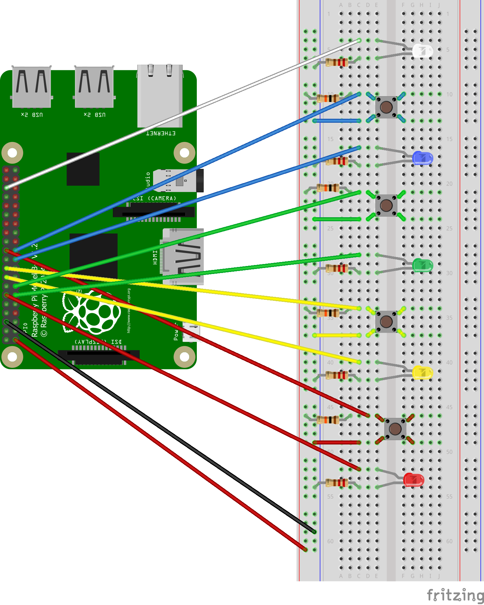

# Simon Says
A Simon Says game for the Raspberry Pi. 

## Table of Contents
- [Project Description](#project-description)
- [Technologies](#technologies)
- [Wiring Diagram](#wiring-diagram)

### Project Description
This is a simple Simon Says game originally made for the Raspberry Pi 3 Model B+.

It was my final project for an x86_64 Assembly Language and Computer Architecture course.

### Technologies
Project is created with:
- Python 3
- Raspberry Pi 3 Model 3 B+
	- 5 colored LEDs (white, blue, green, yellow, red)
	- 4 push-button switches
	- 11 male-to-female jumper wires
	- 4 male-to-male jumper wires
	- 5 220 Ohm resistors
	- 4 10k Ohm resistors
	- 1 breadboard

### Wiring Diagram

The above diagram was created using [Fritzing](https://fritzing.org/)
